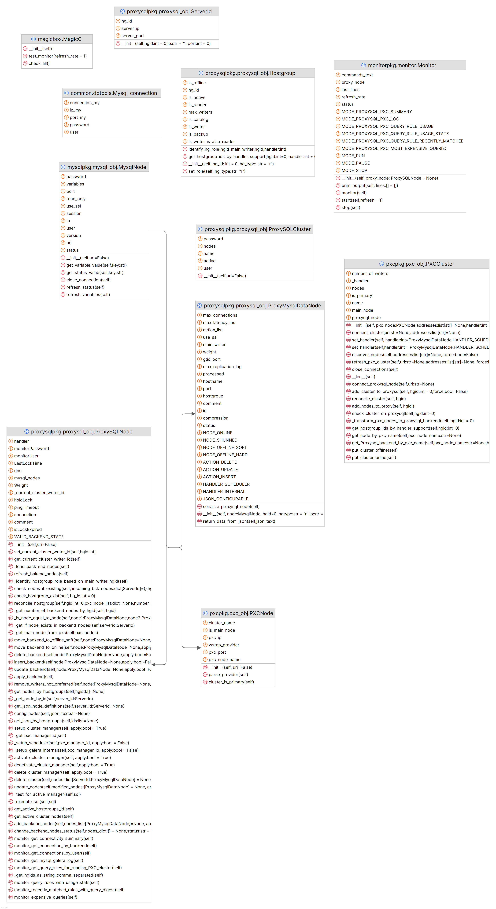

<!-- TOC -->
* [What is this?](#what-is-this)
* [What is already implemented:](#what-is-already-implemented)
  * [Modules required](#modules-required)
  * [Logger](#logger)
  * [when using with MySQL shell](#when-using-with-mysql-shell)
    * [You can call them also from command line:](#you-can-call-them-also-from-command-line)
  * [When running from Python](#when-running-from-python-)
    * [Commands](#commands)
* [Digging a bit inside](#digging-a-bit-inside-)
<!-- TOC -->

# What is this?
MagicBox is a collection of Python scripts that can be run inside MySQL MySQL-Shell, as plugins.
The code is designed to be eventually run also outside the MySQL sell as stand-alone.

The main focus at the moment is to facilitate the management of a Percona XtraDB Cluster inside ProxySQL

# What is already implemented:
- ✔️ Connect to a PXC node and auto discovery the cluster nodes
- ✔️ Based on cluster composition setup proper HGs for basic read/Write split.
  - First node it connects is the Primary Writer
  - Setup the scheduler groups for usage
- (WIP) Sync users between ProxySQL and MySQL (PS)
- ✔️ Monitor given cluster connections and generic usage
- ✔️ Add/delete/modify a node manually
- ✔️ Change state of cluster (Online/Offline/Read_Only/Single Primary/Multi Primary)

## Modules required
pip install mysql-connector-python \
pip install scipy \
pip import pynput  


## Logger
We use logging to print out messages on the console, except for monitor.
During the execution by default the log level is WARNING, 
But we can easily change it doing:

```python
import logging
logging.getLogger().setLevel(logging.INFO)

originalhan = logging.getLogger().handlers[0]
modahnd = logging.StreamHandler()
modahnd.setFormatter(logging.Formatter("%(message)s"))
logging.getLogger().handlers[0]=modahnd

# To put bacj the original
logging.getLogger().handlers[0]=originalhan
```

to see what levels are supported: 
https://docs.python.org/3.13/library/logging.html#logging-levels


## when using with MySQL shell
In mysqlsh the plugin methods will be defined in the init.py file at root level.
At the moment, there are two main plugin methods mainly for test purpose:
- Magicbox.check_all()
- Magicbox.check_monitor()

The Magicbox object is ready to go when you start mysqlsh:
```python
MySQL  Py > Magicbox.help()
NAME
      Magicbox - The magicbox plugin

DESCRIPTION
      The magicbox plugin is going to bring you joy and candies

FUNCTIONS
      check_all()


      test_monitor()


      help([member])
            Provides help about this object and it's members

```

### You can call them also from command line:
```shell
./mysqlsh --py  --execute 'Magicbox.test_monitor()'
```

## When running from Python 
1) Open Python console
2) Import the magicbox top class (that simulates the plugin call in shell)
    ``` python 
   from magicbox import MagicC
   ```
   
3) use MagicC instead magicbox in the following commands
### Commands
```python
MagicC.test_monitor()
```
# Digging a bit inside

## What is the path to create a PXC cluster inside ProxySQL

## What objects we have:


create initial processor:
```python
processor = magicbox.create_pxc_processor("dba:dba@192.168.4.205:3306")
```
Create Cluster inside processor"
```python
cluster = processor.setPXCcluster()
```

Create ProxySQL inside processor:
```python
proxy = processor.setProxySQL("cluster1:clusterpass@192.168.4.191:6032")
```


